# Assignment 3. Responsive Web Design (Media Queries + Bootstrap Grid)
name: Bissentayev madiyar
**Group:** IT-2501

Breakpoints used in all tasks:  mobile — up to 767px, tablet — 768px–991px, desktop — 992px and wider.

---

## Part 1. Media Queries

 Task 0. Responsive Typography
Create a simple webpage with headings and paragraphs. Use media queries to change font sizes for mobile, tablet and desktop.

Files: `task0.html`, `css/task0.css`

Mobile:

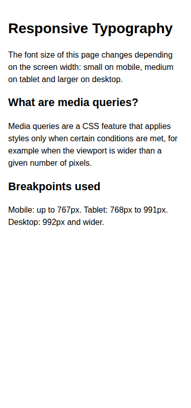

Tablet:

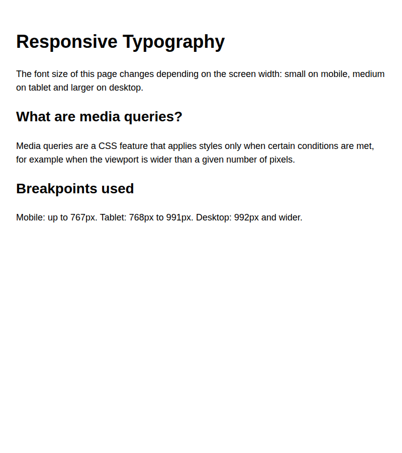

Desktop:

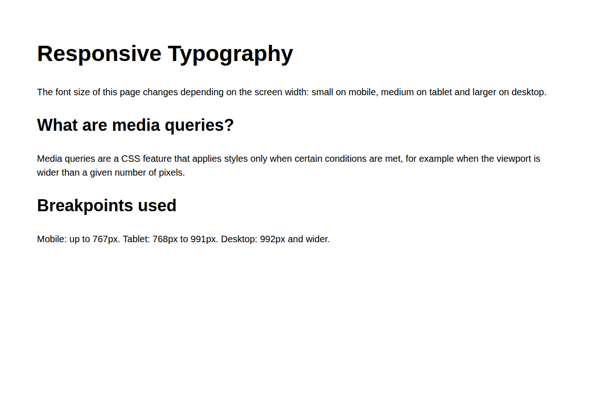

### Task 1. Responsive Layout with Media Queries
Create a webpage with three boxes in a row. Desktop: three side by side. Tablet: two in a row. Mobile: stacked vertically. Use only CSS media queries (no Bootstrap).

Mobile:

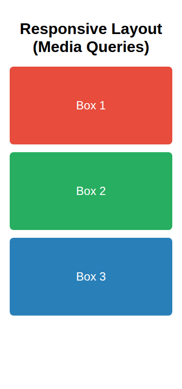

Tablet:

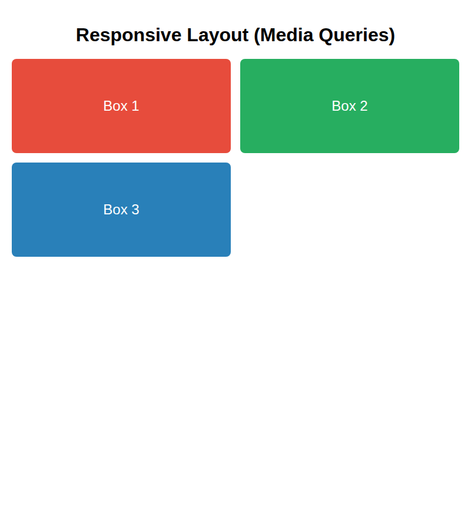

Desktop:

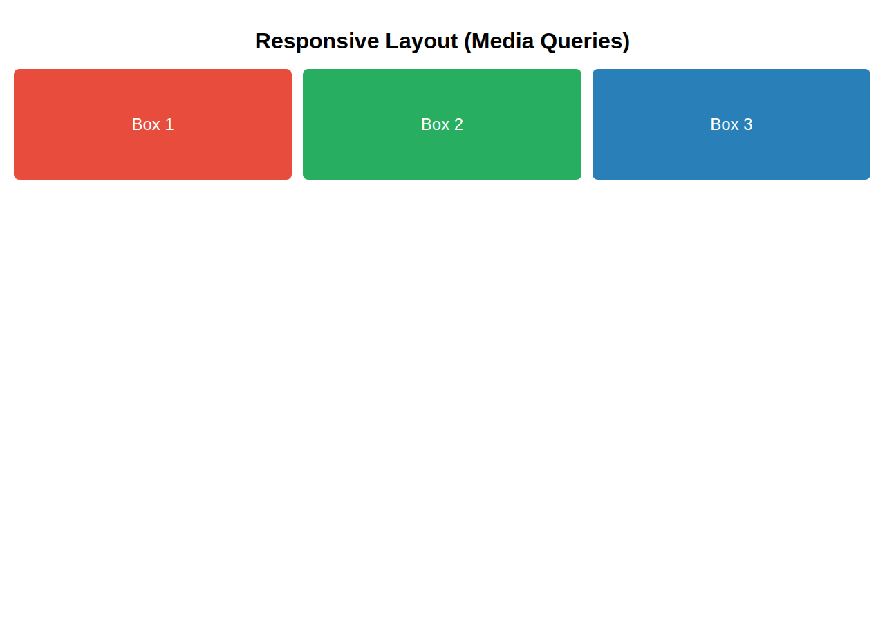

---

## Part 2. Bootstrap Grid System

### Task 2. Bootstrap Responsive Columns
Build a layout with three columns using the 12-column grid. Desktop: each column takes 4 columns. Tablet: two columns in the first row and one in the second. Mobile: all columns stacked.

Mobile:

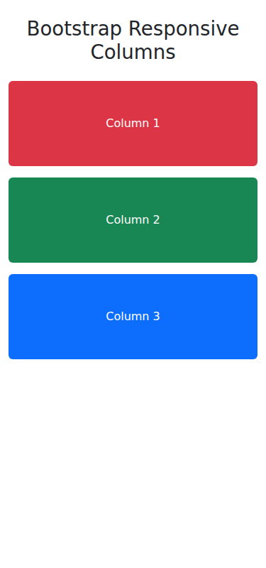

Tablet:

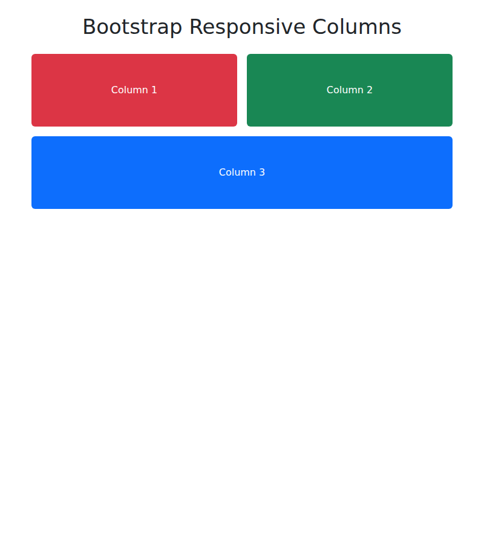

Desktop:

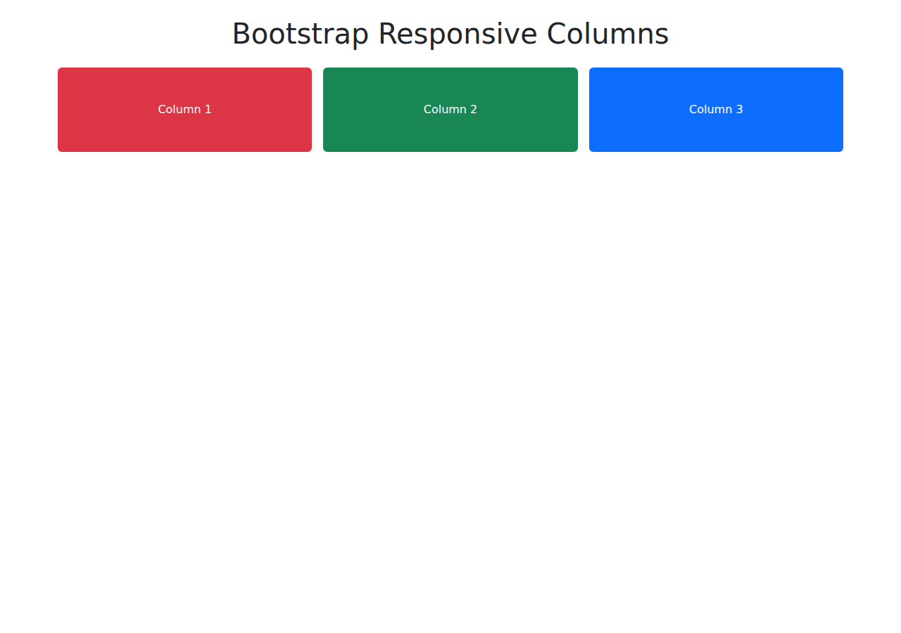

### Task 3. Bootstrap Navigation Bar
Create a responsive navigation bar with a logo on the left, links on the right, and a hamburger menu on smaller screens.

Desktop:

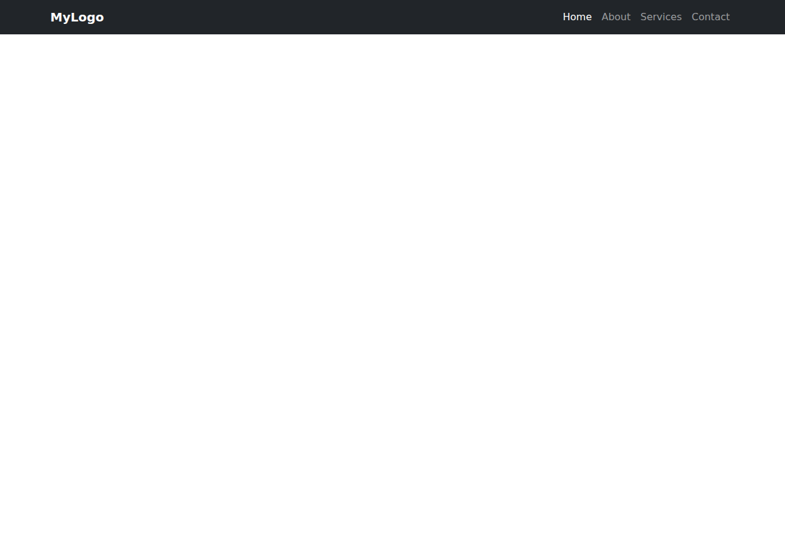

Tablet (collapsed):

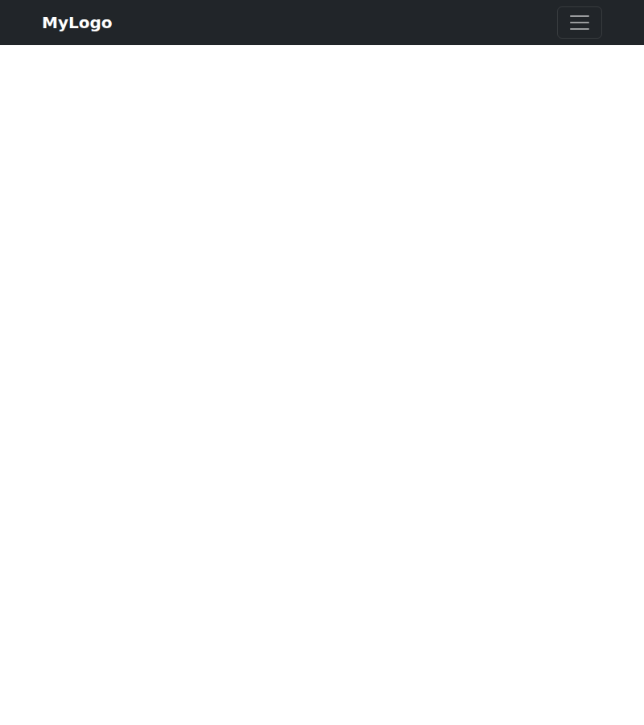

Tablet (menu open):

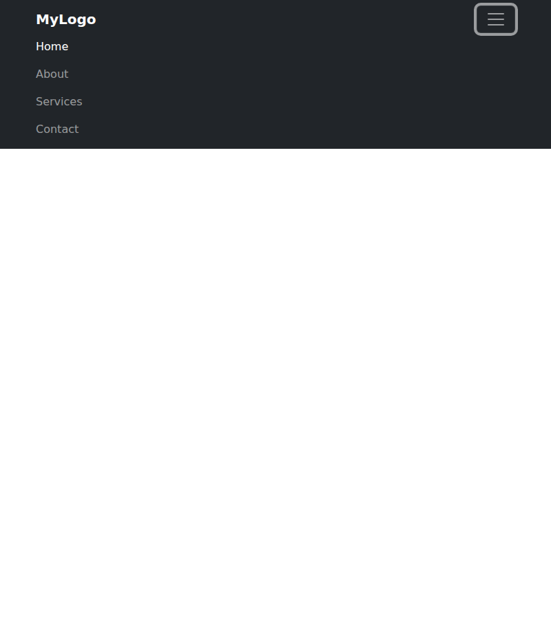

Mobile (collapsed):

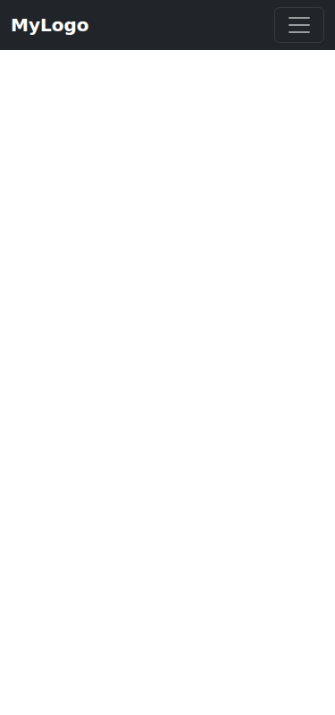

Mobile (menu open):

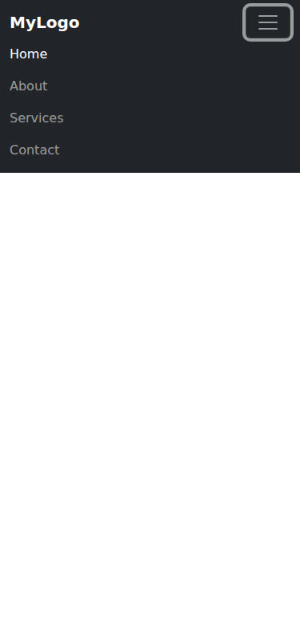

---

## Part 3. Combined Project

### Task 4. Responsive Portfolio Page
Create a portfolio page using both Media Queries and Bootstrap Grid: header with a Bootstrap navbar; main section with portfolio cards on the left and a sidebar with personal info and contacts on the right; footer at the bottom; custom media queries for font sizes, spacing and element visibility.

Mobile:

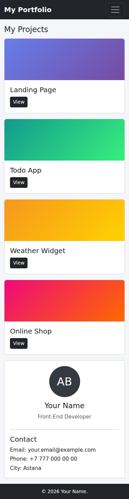

Tablet:

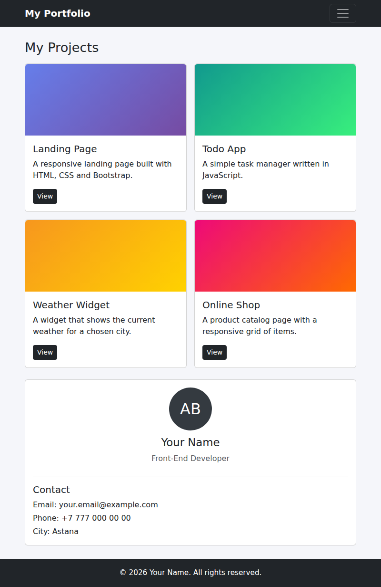

Desktop:

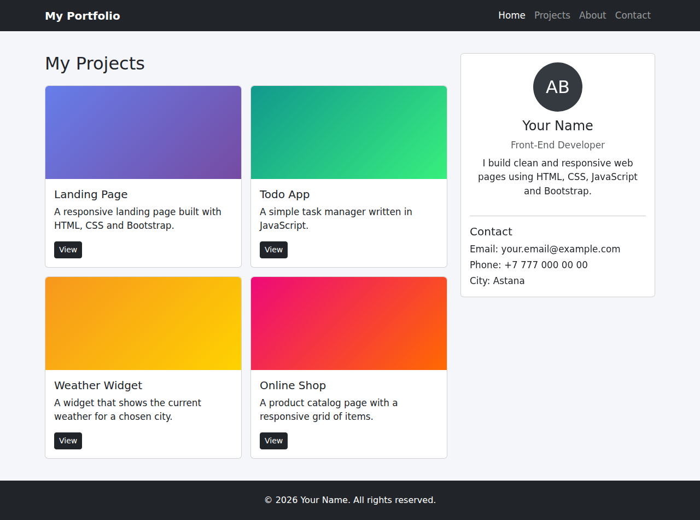

---

At the end , it was maybe one of the most difficult assignment not because of the new technology that i used  but also to find a tablet.
