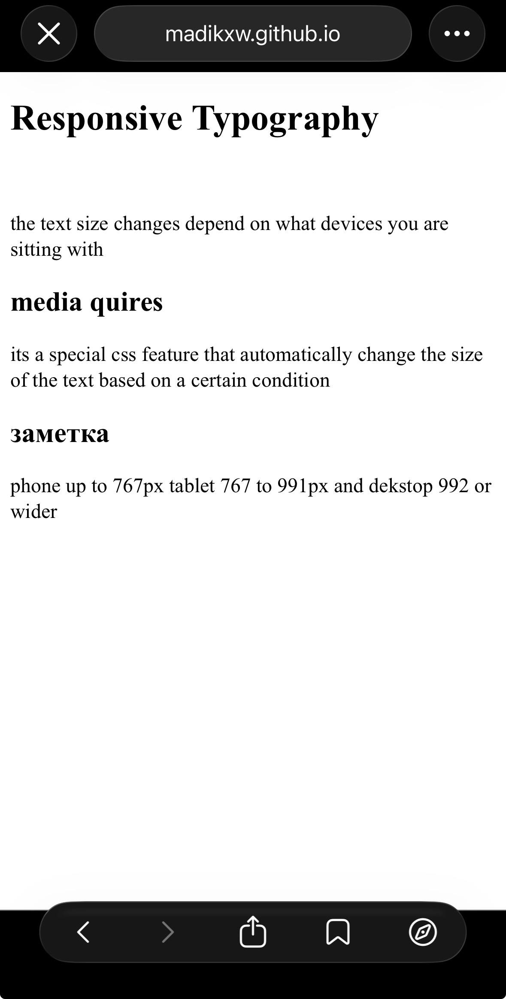
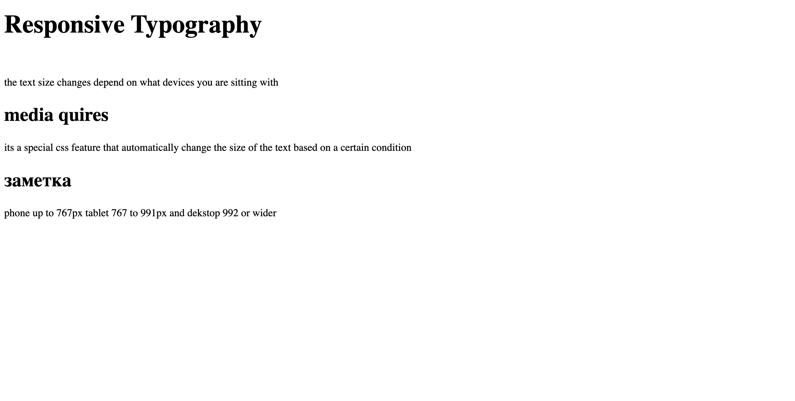
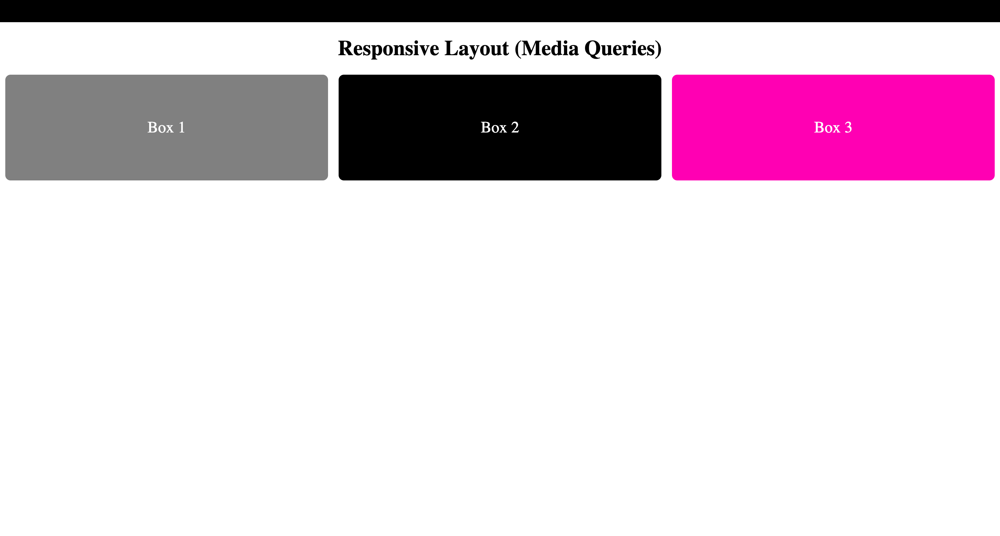
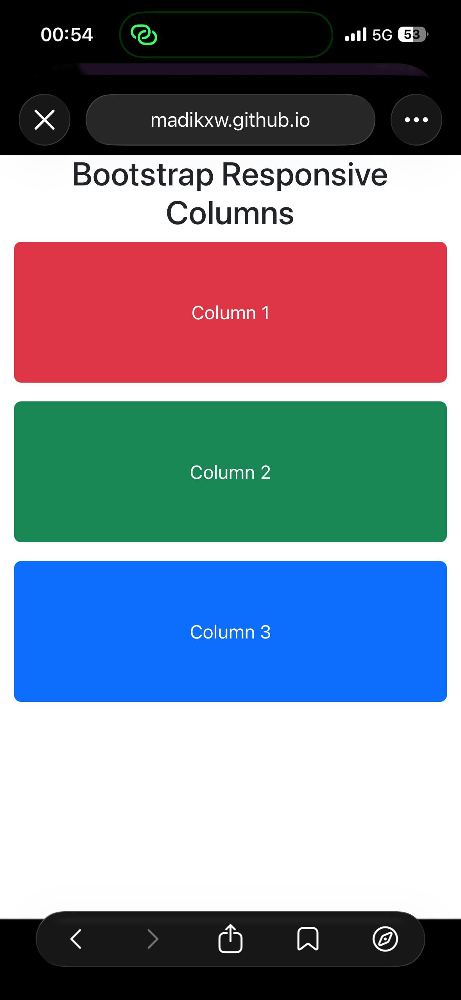
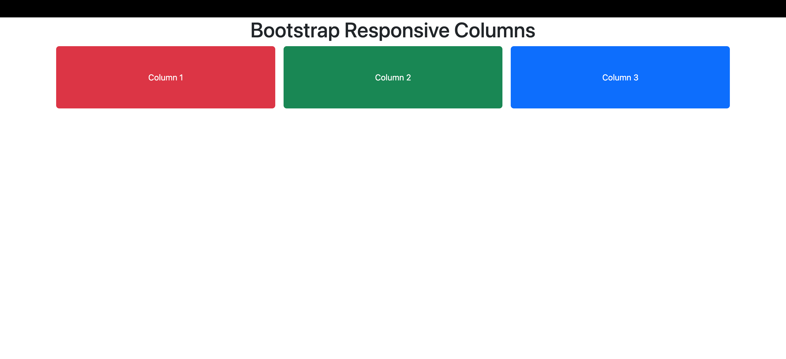
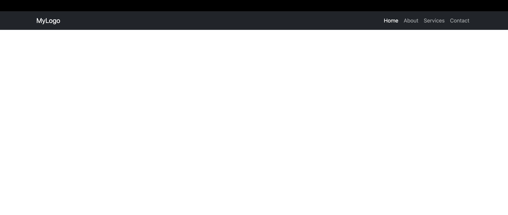
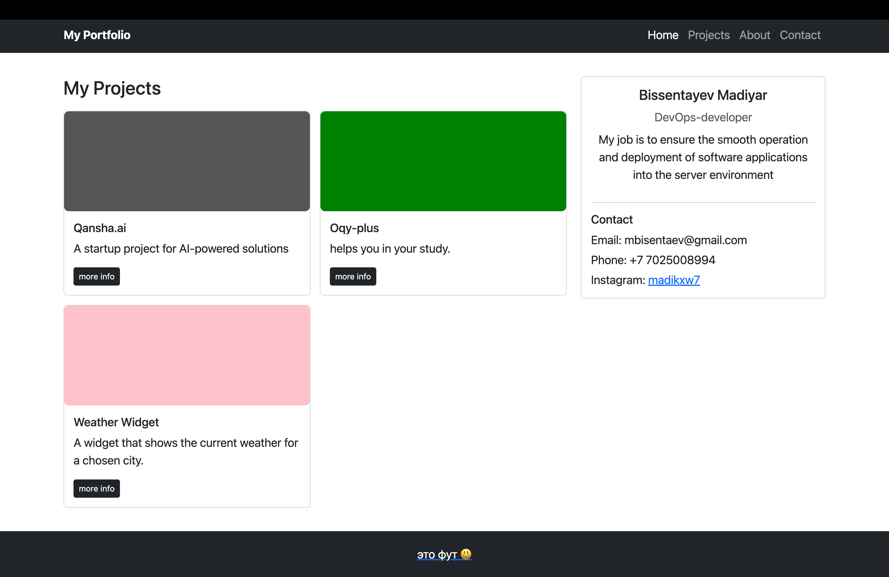

# Assignment 3. Responsive Web Design (Media Queries + Bootstrap Grid)
name: Bissentayev madiyar
**Group:** IT-2501

---

## Part 1. Media Queries

 Task 0. Responsive Typography

Files: `task0.html`, `css/task0.css`

Mobile:

Desktop:

### Task 1. Responsive Layout with Media Queries

Mobile:

Desktop:

---

## Part 2. Bootstrap Grid System

### Task 2. Bootstrap Responsive Columns

Mobile:

Desktop:

### Task 3. Bootstrap Navigation Bar

Desktop:

Mobile (menu open):

---

## Part 3. Combined Project

### Task 4. Responsive Portfolio Page

Mobile:

Desktop:

---

At the end , it was maybe one of the most difficult assignment not because of the new technology that i used  but also to find a tablet.
